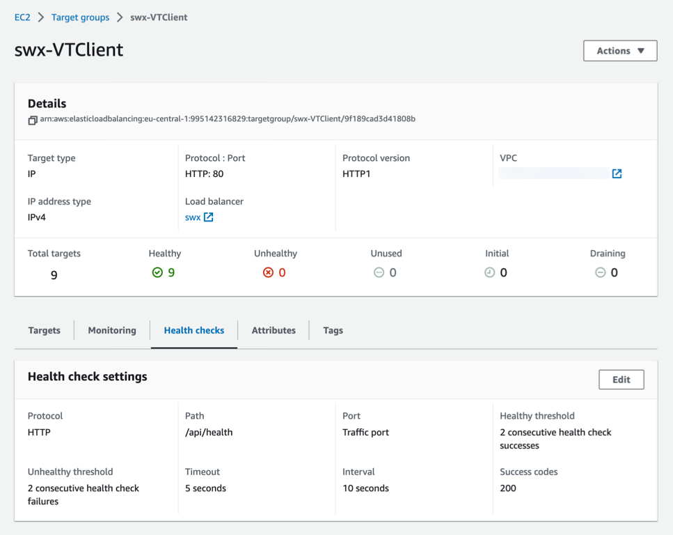
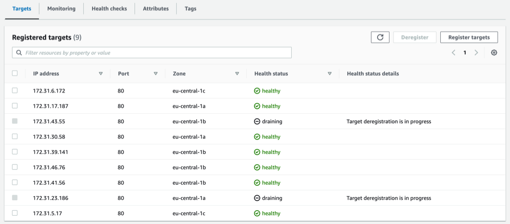

# Cookie domains and AWS Elastic Load Balancer

Found an issue causing some hours to understand and fix. We are running a CodeIgniter 4-based REST back-end behind a AWS Elastic Load Balancer (ELB). The ELB terminates incoming HTTPS requests and forwards the request as HTTP to a *target*, in this case a FARGATE Docker running PHP+apache and our CodeIgniter project.

All was working well while developing and doing the initial testing in the production environment. However, when enabling the ELB *health checks* this started to fail.

## Health Checks

To know what targets are available to handle the traffic, the ELB uses health checks to verify the target is ready to handle traffic. If the target is not healthy, the ELB directs FARGATE to terminate the target and start a new one. After initial health checks pass the ELB will start routing traffic to the new target.

Normally we use a special URI that produces a JSON-encoded reply and a 200 HTTP Status if all is OK. A typical response looks like this:

```json
{
  "REDIS": true,
  "EFS": true,
  "DB": true,
  "env": "area51",
  "hostname": "8ad05d17e297",
  "image": "UserPortalWorker",
  "build": "VT-UPW-JOB1-252",
  "build_timestamp": "2023-02-02T14:09:34.407+01:00",
  "ts": "2023-02-12T12:25:47+00:00",
  "php": "8.1.14",
  "forwarded_for": "50.221.x.y"
}
```

The backend will make sure connections to the REDIS cache, database and mounted file system (`EFS`) are all in good working order. Some information about the built Docker image is also included.

### Configuring Health Checks

ELB Health Checks are configured on the *Target Group* in the AWS Console.



The URL we have standardized on is `/api/health`. The check interval is 10 seconds and a standard HTTP request is sent to the normal traffic port 80 (remember that the ELB terminates the incoming HTTPS request and forwards it as HTTP).

As shown we are running 9 healthy targets at this point.

### When Health Checks fail

If anything else than `200` is reported back, the health check is considered failed and the ELB will stop forwarding traffic to the target. If a consecutive check also fails the target will be terminated.

Dealing with failed health checks could be problematic as the unhealthy targets are terminated and replaced with new instances to reach a steady state. The logs available in the console are not that good either. Normally we reduce the number of targets and increase the health check interval to be able to capture enough information to debug.

## Health Checks use IP!

In this particular issue we got health checks that failed and terminated the targets leaving the system unavailable. As this was after a code-change the answer must be in the change code. 

(All of our work-loads are running in AWS using CloudFormation templates and in a LIVE/STAGING environments so the problems never affected the LIVE work-load.)

One of the recent changes was in an upgrade to CI to version 4.3.1 when I decided to start setting the Cookie domains. As the code was working when accessing it through the web-browser (with Health Checks disabled so the targets were allowed to run for troubleshooting). I had to dig deeper!

### Health Checks use IP-address!

Since the `/api/health` URL produced the correct information when testing in the browser, I had to dig deeper. The targets are registered in various networks (*availability zones* in AWS lingo). 



(The screen-shot is captured during an update where targets are draining - not receiving any more queries - and targets of the new version are registered).

Inside of the ELB there is no DNS, so clearly the targets are accessed using their IP-addresses.

As the FARGATE targets don't have any easy means to access their console I used the *bastion host* to get access to the internal network. From there I ran `wget` to a target and immediately found the problem:

```
[ec2-user@ip-172-31-26-116 ~]$ wget http://172.31.16.205/api/health
--2023-02-11 15:28:42--  http://172.31.16.205/api/health
Connecting to 172.31.16.205:80... connected.
HTTP request sent, awaiting response... 401 Unauthorized
Cookie coming from 172.31.16.205 attempted to set domain to <REDACTED>

Username/Password Authentication Failed.
```

My change in `Config/Cookie.php` to set `$domain` obviously failed! Reverted this change and all is now working.