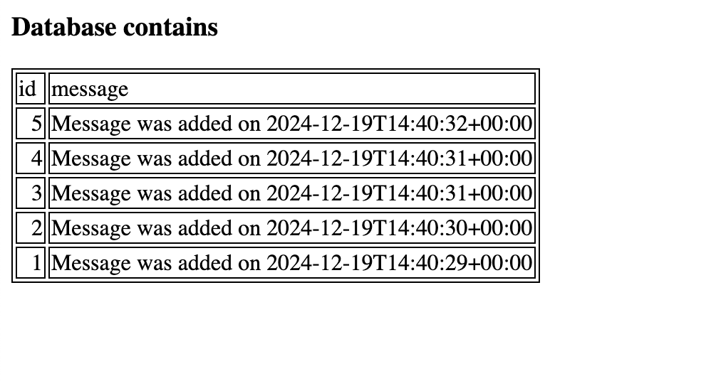

# Docker compose for CodeIgniter development

Recently I started a new development project that I plan to work on together with others. This means that the development environment must be consistent and possible to replicate for the other developers. The project is planned to use a CodeIgniter 4 backend together with a Vue frontend. 

The initial approach is to use Docker to create an isolated PHP 8.2 environment for the development. A separate Maria DB database instance and phpMyAdmin should also be included.

Inspiration for this is taken from the [Docker documentation](https://docs.docker.com/guides/php/containerize/) and the example project they are containerizing. However, I found this guide to be hard to apply to a CodeIgniter project and spent some time tweaking and testing. 

The result is a working development environment and I will continue to document the testing, building and deployment parts of the project in upcoming articles.

For the purpose of creating this, I have used macOS Sequoia 15.2, Docker 27.4.0 and Docker Desktop 4.37.0. 

## Project folder structure

As with other full-stack projects I've done I want to keep the code for the front- and back-end code together in a single git repository. When deploying, the compiled front-end will go to CodeIgniter's `public` directory and the frontend directory is deleted.

For development, the `backend` directory is copied to `/var/www/html` and the `public` directory is set as `DocumentRoot` in apache.

Conceptual structure:

```
docker-ci4-dev
	│
	├── backend             /* CodeIgniter app-starter */
	│   ├── app
	│   ├── public
	│   ├── tests
	│   ├── vendor
	│   └── ...
	├── db                   
	│   └── password.txt    /* Maria DB config */
	├── deploy              /* apache and php config */
	│   ├── my-000-default.conf
	│   └── xdebug.ini
	├── frontend
	│   └── ...             /* Vue project */
	├── .dockerignore
	├── composer.yaml
	└── Dockerfile
```

Building and running the Docker environment is done from the project's root.

The project root-folder is `docker-ci4-dev` and is the directory added to git.

## Creating CodeIgniter project

First thing is to create the CodeIgniter 4 project. Using the latest version and composer, run the following in the project root to install CodeIgniter's appstarter project:

```
composer create-project codeigniter4/appstarter backend
```

Create the support directories in the same directory:

```
mkdir db && mkdir deploy
```

Setting up the default password for Maria DB. This should be handled in a secure way so the file is not included in the repository.

```
echo "db/password.txt" >> .gitignore
echo "example" >> db/password.txt
touch db/.gitkeep
```

## Dockerfile, compose.yml and configuration

From the `project-root` directory in this article, copy the files `./Dockerfile`, `./compose.yml` and the directory `./deploy`. The `./deploy` directory contains the settings for `apache` and `xdebug`.

When the container starts, we want to run the latest database migrations automatically. This is achieved by the script `backend/start.sh` that contains the code for this:

```bash
#!/bin/sh
cd /var/www/html
php spark migrate && apache2ctl -D FOREGROUND
```

Copy this file to the same location.

With these files in place, it should now be possible to start the container stack with the command:

```
docker compose up --build
```

The stack should build and start and the familiar CodeIgniter home page should be available at `http://localhost:9000`.

Remove the stack:
```
docker compose down
```

## Testing the database and persistence of data

To make sure all works with connectivity to the Maria DB and that the data is retained between runs, a CI migration and sample Controller is created. Copy the files over from `project-root/app/backend` into the same locations in the target project.

Check the file `env-dist` to make sure the password is set correctly and then rename the file `.env`.

It should now be possible to start the container stack again:

```
docker compose up --build
```

Navigate to `http://localhost:9000/database` and you should get a list of messages added to the database. For each refresh of the page, a new message is added.



Time to test the persistence of the data. Shut down the stack with `CTRL-C` and then remove the stack:

```
docker compose down
```

Restart the stack:

```
docker compose up
```

Go back to the page `http://localhost:9000/database` - the messages should still be there and a new added.

Stop (`CTRL-C`) and remove the stack a final time.

```
docker compose down
```

## Testing change watch for development

Time to make sure we can develop the backend application and have the changes included in the container. This is handled with the `watch` command to `docker compose`. Restart the stack using

```
docker compose watch
```

The status should now include `Watch enabled` at the prompt. 

```
[+] Running 4/4o docker.io/library/docker-ci4-dev-server                                       0.0s
 ✔ Service server                         Built                                                2.0s
 ✔ Container docker-ci4-dev-db-1          Healthy                                             10.6s
 ✔ Container docker-ci4-dev-server-1      Started                                             10.7s
 ✔ Container docker-ci4-dev-phpmyadmin-1  Started                                              0.2s
Watch enabled
```

Open `backend/app/Views/database_table.php` and change the heading in the `<h3>` tag and save the file. Checking the terminal, the message `Syncing service "server" after 1 changes were detected` should be displayed. 

Reload the page and you should see your change.

**We are ready to start develop the backend!** More to follow.