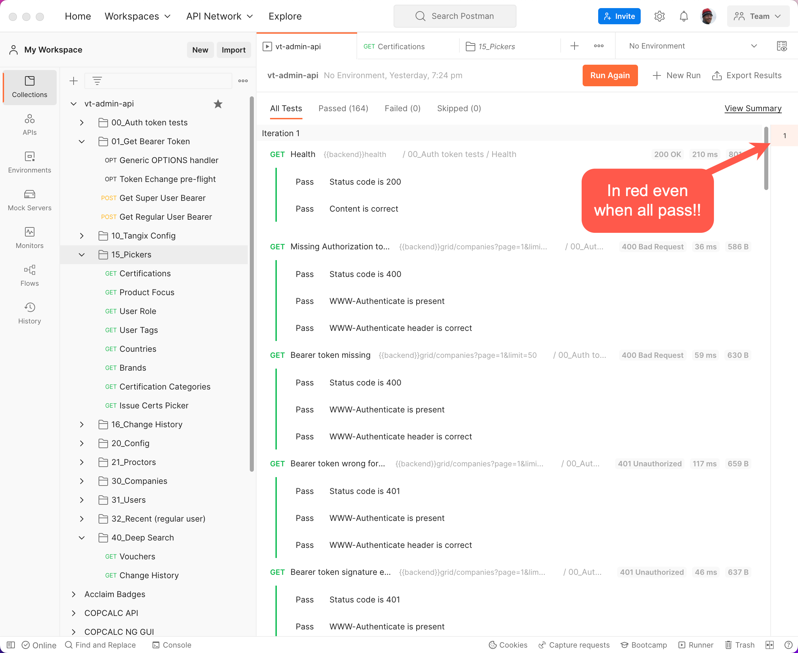

# Testing your CodeIgniter backend API with Postman

**Disclaimer: I am just a happy customer of Postman. I have not received any compensation or other benefits from them to write this article.** 

Upgrading a working piece of code is always scary - what will break? Basing your code on third party libraries add even more stress - will a simple `composer update` render your project non-working?

Our journey with API testing started with version 4.1.2 of CodeIgniter which changed (broke) the behavior of how casts worked. Suddenly our users reported multiple blank comboboxes in the front end and it was due to an upgrade from CI 4.1.1 to 4.1.2.

This became the wake-up call we needed for stepping up testing. We found [Postman](https://www.postman.com/), a rather complex environment with it's own IDE and API mock service so it can be daunting to start with.

### Addressing the elephant in the room - pricing

As with most services and tools these days I think Postman is a too expensive and aimed at larger development teams. We are grandfathered in to a $49/year/user plan with I think is reasonably priced compared to the Basic plan at $144/year/user.

We only use Postman for testing and haven't created any mocked APIs, but that could be an interesting approach when testing the front-end part of our project.


The backend uses Bearer authentication tokens instead of cookies and this was the first hurdle to negotiate in Postman. The JavaScript front end keeps the Bearer-token and sends that with every request. With some help from youtube and Google we managed to get this going in Postman as well.

A test in Postman is defined by a request and then a JavaScript is executed where you write your test. Similar to many other testing languages it relies on a (somewhat) easy to read code, heavily using fluent interfaces. This is an example, checking status code of the response and then actually parsing stuff in the returned JSON:

```javascript
pm.test("Status code is 200", function () {
    pm.response.to.have.status(200);
});
pm.test("Contains correct data", function () {
    var jsonData = pm.response.json();
    pm.expect(jsonData.data).to.exist;
    pm.expect(jsonData.data).to.be.an("array");
    pm.expect(jsonData.data[0]).to.haveOwnProperty('certCatLink');
    pm.expect(jsonData.data[0].certCatLink).to.be.a('number');
    pm.expect(jsonData.data.length).to.greaterThan(50); 

});
```

The change in casts in CodeIgniter 4.1.2 gave us problems with arrays so we are now carefully testing for this.

Tests are grouped into a *Collection* which allows multiple tests to be executed in succession. Collections can be organized into folders which is great. A Collection contains logic to share variables and authentication among the tests in a Collection.

## Good things

### CLI runner available

There is a CLI companion to the IDE called `newman` (can be installed through homebrew) that can be used to run test as part of a `git` commit. An API Key is required to run a Collection and to avoid checking in the API Key we store it in `.env` and have a CLI-only Controller in the project get it for `newman`. In `composer.json`:

```json
  "scripts": {
    ...
    "newman": "export APIKEY=`php public/index.php tools/newman_apikey`; newman run -k https://api.getpostman.com/collections/******-***********-************?apikey=$APIKEY"
  },
  ```

### Easy when you learned the test syntax

The descriptive style of defining the tests was hard to like at first. 

There are still some strange things, for example why haven't they defined functions so that `pm.expect(jsonData.data).to.be.an("array");` could have been written `pm.expect(jsonData.data).to.be.an.array;` and thus avoiding the possibility to mistype the string?

### Full integration testing

Compared to unit-testing this way of testing is also including the configuration of the framework which is a really good thing. We have tried unit-testing in CodeIgniter but found them to be too detailed and also too complex to define with the database seeding and migrations.

## Not so good things

### Generic test scripts

It is possible to configure a per-Collection or per-Folder test script and that would be great for most use-cases (such as when all tests in a Folder returns 200 status). Unfortunately it's not always the case, you would for example run tests with requests generating 403 or 404 status. This is not possible. Code duplication is the result.

### Collection results arranged vertically

The results of a Collection run is arranged vertically and not organized into the Folders. No summary at the top and the iterator indication is always shown in red!



Without scrolling it's thus easy to miss failed tests and also to find the definition of a failed test so it can be investigated. For example `phpunit` does a much better job that this.
