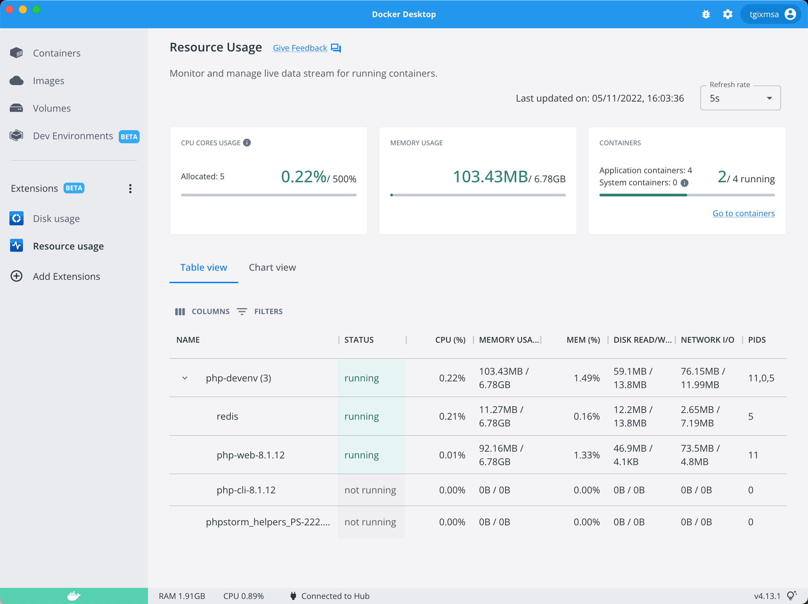
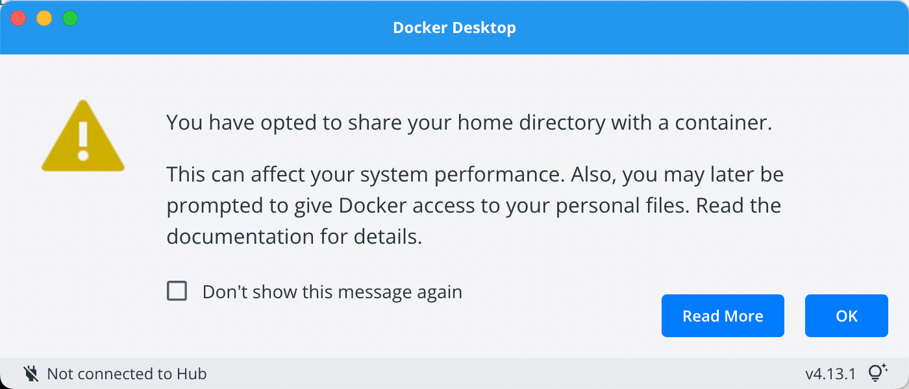

# Rethinking My PHP Development Environment (Part 2)

## Installing Docker Desktop

Docker is installed and tested in both the CLI and the Desktop application. Version 14.3.1 is the latest at this time. Although not needed, my company has a Pro license of Docker Desktop to give support for the continued development. Only post-install step was to enable the *Beta Features* for the new Virtualization framework and the VirtioFS accelerated directory sharing. 

Experimented using the `--platform linux/arm64` flag to make sure docker images work but found out that the images I will use are already available in ARM versions and thus runs natively.

## Docker Extensions

Still in beta but I found two great extensions to use in Docker Desktop; *Disk usage* and *Resource usage*.



The quick overview of allocated resources was indeed helpful and allowed me to scale down the allocated RAM from 8 GB (default) to 6GB without any noticeable slowdown.

## Updates and Comments

### 2022-11-14

Got error `docker: invalid reference format: repository name must be lowercase.`  when trying to run a project.

Found out that the volume mapping breaks if the path to the project directory contains spaces. Fixed this in `zshdocker` by enclosing the mapping in quotes. 

### 2022-11-08

Need to get the PHP 7.4 version up and running for web-development. Found out it's easier to script the change when having generic 7.4 or 8.1 image names. Changed the name of the build images for `apache` to include the version in the image name instead of the name of the container. Also noticing my PHP 7.4 project requires `mcrypt`. 

Added the `sphp` function to `zshdocker` file.

## Organizing stuff

I mainly live in the Terminal on the command line or in PhpStorm. Having an organized and efficient structure is important for me. I keep all my work in `~/Tangix_Work/` with important projects having names starting with `_` to be at the top of the list. A couple of `zsh` functions and aliases help me move around quickly - for example `tw` taking me directly to the work directory or `gh` taking me to the directory of all my GitHub projects.

My new development environment is important and will thus have an underscore in the name and live in `~/Tangix_Work/_devenv` (having `de` as a quick shortcut).

Taking inspiration from [Pascal Landau's articles](https://www.pascallandau.com/blog/phpstorm-docker-xdebug-3-php-8-1-in-2022/) I created a [`Makefile`](code/Makefile) and a folder structure like this:

```
_devenv
│   Makefile
│   zshdocker
├───conf-data
│   ├───apache
│   │   │   httpd-ssl.conf
│   │   │   httpd-tangix.conf
│   │   └───ssl
│   └───php81
│       │   httpd-ssl.conf
│       │   httpd-tangix.conf
│       └───conf.d
│              error_reporting.ini
│              xdebug.ini
│              zzz-tangix.ini
└───docker-compose
    │   .env
    │   docker-compose.yaml
    └───php	
        └───php81
               Dockerfile
```

In the `Makefile`, `init` and `build` commands are defined. `make init` generates the shared data volumes in docker. `make build` runs `docker compose` from the `./docker-compose` directory. The `.env` file defines what versions we want (another inspiration from Pascal's article):

```
REDIS_VERSION=7.0.5
PHP81_VERSION=8.1.12
PHP74_VERSION=7.4.32
COMPOSER_VERSION=2.4.4
```

These settings are propagated into the build settings through the `docker-composer.yaml` by using `args`:

```
version: '3.9'

name: php-devenv

services:
    redis:
       ...

    php81:
      image: tangix:8.1-apache
      container_name: "php-web-${PHP81_VERSION}"
      volumes:
        ...
      tty: true
      ports:
	    ...
      expose:
	    ...
      restart: unless-stopped
      environment:
        ...
      build:
        context: ../
        dockerfile: images/php/php81/Dockerfile
        args:
          TYPE: apache
          PHP81_VERSION: ${PHP81_VERSION}

    php81-cli:
      image: tangix:8.1-cli
      container_name: "php-cli-${PHP81_VERSION}"
      volumes:
        ...
      tty: true
      expose:
        ...
      restart: 'no'
      environment:
        DOCKER_TYPE: cli
      build:
        context: ../
        dockerfile: images/php/php81/Dockerfile
        args:
          TYPE: cli
          PHP81_VERSION: ${PHP81_VERSION}

volumes:
  redis-data:
    external: true
  composer-cache:
    external: true
```

As seen, the builds share the same `Dockerfile` and the `TYPE` argument is passed to the build to indicate `web` or `cli` build. The naming of the built image only contains `81` and not the actual version number to allow scripts to be as generic as possible.

Executing `make build` generates the docker stack with `redis` and two PHP images, one for web and one for CLI use. The name of the containers include the PHP version.

### zshdocker file

The [zshdocker](code/zshdocker) file defines a function to launch a php CLI or a php command. This allows running `composer` and `phpunit` in the context to the installed PHP version. By using aliases and arguments to the `php81run` function, I can run:

```
msa@sindre _devenv % php -v
PHP 8.1.12 (cli) (built: Oct 28 2022 18:42:23) (NTS)
Copyright (c) The PHP Group
Zend Engine v4.1.12, Copyright (c) Zend Technologies
    with Zend OPcache v8.1.12, Copyright (c), by Zend Technologies
    with Xdebug v3.1.5, Copyright (c) 2002-2022, by Derick Rethans
msa@sindre _devenv % 
```

Running a script:

```
msa@sindre _devenv % php hello-world.php 
Hello World!
```

The `php81run` function maps and sets the current host directory to the Docker container process and then executes the `php` command with the passed arguments *in the docker container*. 

The amazing with this approach is that the `php` command is running inside a container with the installed version! Additional aliases allows running `composer` in the same way from the command prompt.

### Comments regarding zsdhdocker commands

This is a list of some of the things I have learned when working with this development setup related to Docker:

#### Handling CTRL-C

To make sure signals such as CTRL-C works in the interactive docker tty, add `--init` to the container `run` arguments.

#### Mounting home directory

Docker is not happy if trying to mount `~` in the container. A warning message is displayed:



To handle this, a check is present in `zshdocker` and prompting the user to go to a `temp` directory instead.

#### managing Path Mappings in PhpStorm

The `PHP_IDE_CONFIG` environment variable is set in the running container to indicate to PhpStorm the `serverName` and then allow each project to have a separate path mapping for debugging. The `serverName` is constructed as `docker-${PWD##*/}` where `${PWD##*/}` gives the name of the directory.

#### Switching between PHP version for apache

Switching between 8.1 and 7.4 is done with the `sphp` function requiring `7.4` or `8.1` as argument.