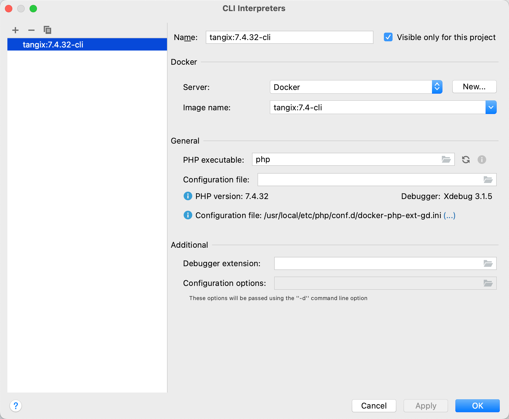
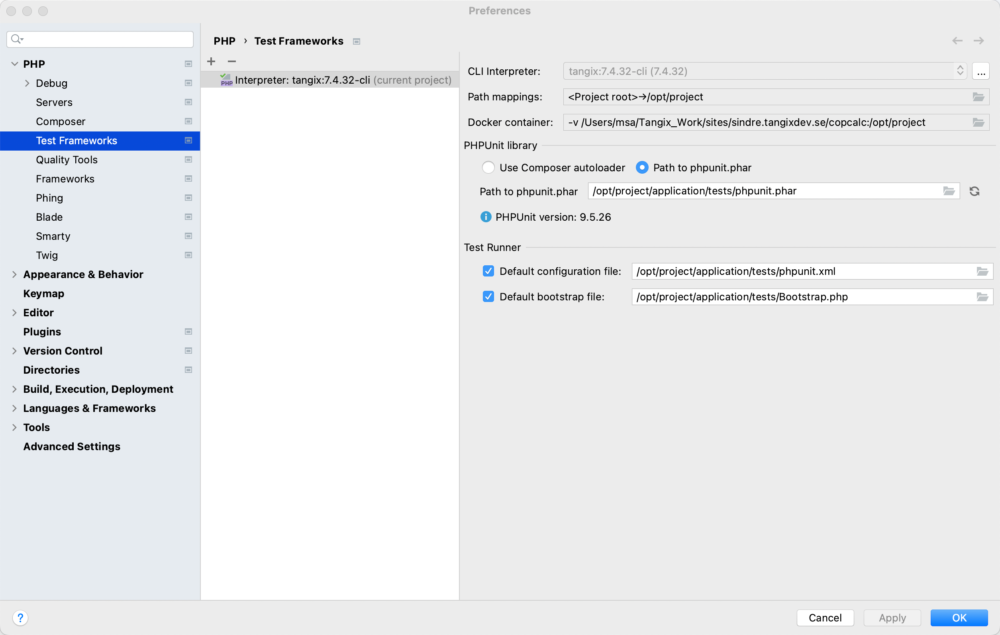

# Fast-forward to 2022 with a PHP 7.4 project

One of our projects are still on PHP 7.4 and this is a write-up of how to migrate that to use the Docker development environment.

The ugly truth of this project written in CodeIgniter 3.1 is that it is using [ci-phpunit-test](https://github.com/kenjis/ci-phpunit-test) in a really old version running PHP 5.6 and `phpunit` version 5.6.7 using PhpStorm's build-in execution environment pointing to the old PHP 5.6 binary file...

## Getting PhpStorm to run using Docker

After building a Docker image for `7.4-cli`, setting up PhpStorm to run `phpunit` in that Docker image is a multi-step project.

First define a CLI Interpreter. I am using the `cli` version of my PHP 7.4 image here.

After this is configured, define a Test Framework using that interpreter. 

### Problems

Here I noticed that the `phpunit` version used in the project was too old. This required me to update `ci-phpunit-test` as well. With over 8000 assertions this will be a daunting task!

Multiple functions have been changed from `phpunit` 5.6 to 9.5 so the tests need to be updated:

* `assertContains()` is now replaced by `assertStringContainsString()`.

* `assertEquals()` is now replaced by `assertEqualsWithDelta()` with the caveat that the arguments are swapped

* `setUp()` must specify `void` as return type

* problems with process isolation. We are using the ChartDirectory library to generate graphs and this library makes use of globals causing `phpunit` tests to start failing.