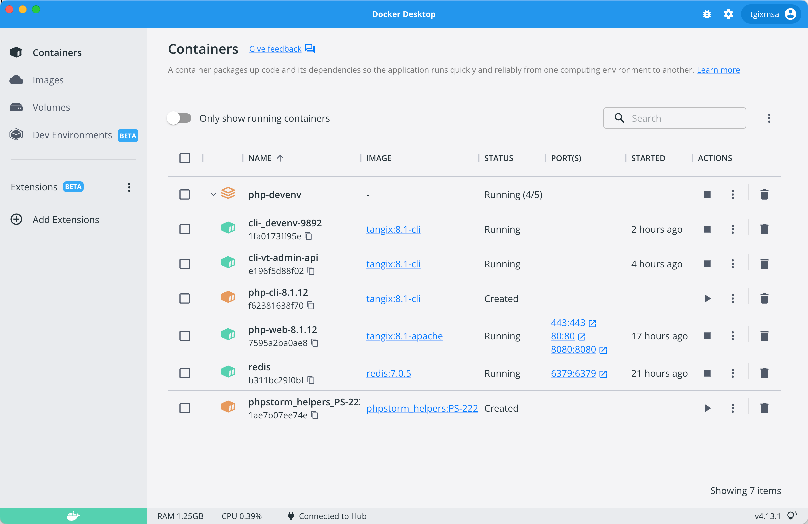

# Rethinking My PHP Development Environment (Part 1)

**This is `// WIP` (Work In Progress) so changes are likely to occur as I am using my environment and making changes.**

## Sources of inspiration and previous work

This looks to be a series of articles documenting the setup I have created. I have found inspiration from many articles on the web but found them overly complex or not meeting my requirements. Articles on the [PhpStorm blog](https://www.jetbrains.com/help/phpstorm/docker.html) together with [Pascal Landau's articles](https://www.pascallandau.com/blog/phpstorm-docker-xdebug-3-php-8-1-in-2022/) have been of great help.

I have identified two issues with these sources of information. First, the support for actually running PHP in Docker for development seems to have been down-played in PhpStorm in recent years. The image repo is not well-maintained anymore. JetBrains are leaving the computer for the cloud and with JetBrains Fleet, the need for a local Docker will be reduced.

Second, Pascal Landau has made a great work with connecting dev, testing and production into a Docker-based workflow. We are running CI/CO on a separate system and production in an even more different environment. The need to replicate or build for production locally is thus non-existing. However, Pascal's way of managing the local Docker images and installation has been a great source of inspiration to me.

## Background

I have been on a MacBook Pro 16" Intel i7 16/512 since November 2019. This machine has worked well but have been through much. Physically it's been traveling the world with me on many trips. One of the USB-C ports are non-functioning and the battery life is now down to about 1.5 hour. The computer has mainly been used in clam-shell mode (i.e. "shut") and I have been using a USB-C hub to hook up monitors and peripherals. I have later learned that exclusively using the computer in clam-shell mode is bad for battery as it runs hot.

OS-wise the situation is not much better. I can't remember what the original OS was, likely Catalina, and it has thus been updated twice to get to Monterey. The OS upgrades have been fine but stuff breaks in these upgrades, especially true for JAVA. 

During the time with the old machine I have been working with PHP version 5.6, 7.2, 7.4, 8.0 and 8.1. All have been installed using homebrew and then I have used `sphp` script to switch between PHP versions, requiring a apache restart.

PhpStorm has been my development IDE for many years and I am used to the way it works.

### Old Development Environment

MySQL Server CE is installed from the binaries provided by MySQL. `apache` and `redis` were installed using homebrew and on top of this PHP versions installed as time progressed. Every upgrade was scary and with the aggressive pace of removing unsupported stuff from homebrew forcing my to use taps from other sources [shivammathur's](https://github.com/shivammathur/homebrew-php) was the one I preferred and sponsored.

`redis` and `apache` has their own problems playing nice with macOS's service launcher. Starting them using `sudo` created issues every time they were updated by homebrew, most of time requiring a restart.

### Problems to solve

When migrating into my new MacBook Pro 16" M1 Pro 32/512 I set out to solve a couple of things that have been causing issues or needed improvement:

* Remove the need for third-party taps and other tools for unsupported PHP versions
* Compilation of some old PHP versions required hacking the build files due to dependencies on older versions of other libraries (yes, looking at you `ucilib`)
* Make `redis` more stable and not so hard to get working after a `brew update`
* Make `apache` work properly even after switching PHP versions
* Learn more about Docker by running it locally as well

## Rethinking my Environment

### Database 

Starting with the database I saw no need to make any changes here. The MySQL installation on the old machine has never been updated since installation and just ticks on. We are not using any fancy stuff in the database because we run production systems on a different database, AWS RDS (a MySQL clone) or `mariadb` for projects not running i AWS. 

Since MariaDB is not available as an installation package for macOS and I don't want to install it through homebrew due to launchd issues the choice here is easy. Install MySQL Server CE version. I was happy to find a arm-version.

### Redis

Because of all the issues I have experienced with `redis` I was very sure I wanted to run this in isolation. Since Docker is what we use in production I decided to start running `redis-server` as a dockerized service locally using the official images from docker.com. This also allows me to control pace of upgrade instead of homebrew, great!

### Apache

Starting down the Docker-way with redis it was natural to continue with apache in Docker as well. In production we are using the official `php-apache` and `php-cli` images so they are tied to the PHP version used. No point in migrating to `nginx` and `fpm` has been identified. This would also mimic the production environment.

### PHP

The toughest nut to crack! My required versions of PHP has been reduced during the years. The 5.6 and 7.2 projects has been migrated to 8.1. One project is still on 7.4 so a setup with 7.4 and 8.1 of PHP would work. Both versions are still supported which is great. So, instead of five versions I could get by with two!

Running php in `apache` using the Docker images using a mounted volume from the source directory is well supported and understood. Our five years of running Docker in our production workloads have been great and we know how to create and maintain the images.

Running PHP in CLI is a different thing. Some things require CLI access for PHP, for example `composer` and `phpunit`. We have that configured in the CI/CO pipe-line with BAMBOO running `phpunit` etc as part of the Docker image build. This must thus be available in the local development as well.

## Summary

### MySQL

MySQL Server CE will be running natively in macOS since no project so far has had any problems with this. MySQL Server hasn't caused any issues in the years I have been running it. Keeping this as-is from my old environment.

### Redis 

With the issues running a homebrew-managed `redis` this service will be moved to a separate Docker instance. 

### PHP (web)

Running PHP for the web is an easy decision. Configuring PHP, `apache` and SSL is easily accomplished. With the recent improvements in disk access in Docker 4.13 on macOS mounting the source and allow it run in Docker solves this issue. Setting up XDebug requires some additional steps but the integration in PhpStorm for this is well-understood and described. Mapping paths is a nuisance though. 

### PHP (cli)

Running PHP from the CLI is a different problem. Docker provides a way to run commands in a container. The way BAMBOO is using Docker to produce the builds may help us understand how this could be accomplished.

## Part 2

Part 2 of this series will describe the Docker setup and the tooling I have been using to maintain the setup. Leaving you with the current state of my Docker environment.

Until next time.