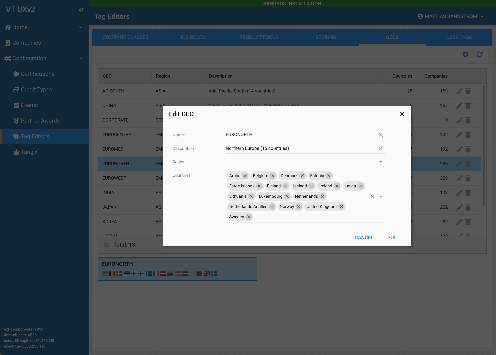

# My use of Filters for Authorization in a RESTful admin interface

*Inspired by the discussions on [CodeIgniter Forums](https://forum.codeigniter.com/thread-78170-post-382557.html#pid382557). My response morphed into a blog-post but since I don't have a blogging platform to publish on I posted it here instead.*

## Background
This is a more detailed description of how I handle requests in a RESTful back-end services to an admin system. 

Requests are coming from a Single Page Application (SPA) JavaScript application written in [Sencha ExtJS](https://www.sencha.com/products/extjs/) with documentation 
 [here](https://docs.sencha.com/extjs/7.2.0/modern/Ext.html). 
 
 *I am not in any way affiliated with Sencha other than being a veteran user and does not benefit in any way from this (or other) mentions.*

 

All requests are made using the standard CRUD verbs and using RESTful URIs. Because of how ExtJS works, these requests may contain arguments for paging and filtering store information. 

All responses are JSON-encoded objects designed to match the responses expected by ExtJS framework's different components, mainly stores and models.

As of this writing, the back-end consists of 21 Controllers, 30 Models + Entities and 15 support classes (Filters, Libraries etc).

## Authorization
Authentication is made through a static HTML-page and the SPA receives a [JWT-based](https://jwt.io/) ``Authortization Bearer`` token that is transferred to the SPA and then used throughout the life-span of the session. 

JWT and ``Authorization`` header was chosen over cookies because the production system is running across different domains. By not using PHP sessions I also hoped to increase the throughput of the requests by not locking sessions during the request.

To work with the JWT two libraries are used, [php-jwt](https://github.com/firebase/php-jwt) and [php-ulid](https://github.com/robinvdvleuten/php-ulid). I have standardized on ULID instead of UUID beacuse of the readability and sortability of the identifiers.

All incoming requests are checked for the ``Authorization Bearer`` header before they are routed further in the back-end. The JWT  contains a ``jti`` that uniquely identifies the user to the back-end. The JWT also contains a list of the user's permissions that is used by the front-end SPA to populate the menu and views.

The JWT payload of the JWT looks like this:

```json
{
  "iss": "https://<endpoint>",
  "iat": 1607668914,
  "jti": "01ES88HPR3CVCC8VWWRDBB9HG8",
  "nbf": 1607668913,
  "exp": 1607704914,
  "access": {
    "comp": 775,
    "empl": 263,
    "user": 3847,
    "gen": 209664,
    "event": 199427,
    "conf": 1249024,
    "rep": 1792
  }
}
```

The ``access`` block is a bit-field of permissions to different sections of the system and match with various menu options in the SPA.

## CI4 Configuration

For this project the following configurations are done in ``app/Config``.

### App.php
Here a ``__construct()`` is handling configuration from the Docker environment to make the back-end aware of Production, Staging or Development. ``RUNNING_ENV`` is set in the Docker container definition to the name of the AWS VPC.

```php
public function __construct()
{
    parent::__construct();

    if (isset($_ENV['RUNNING_ENV'])) {
        if ($_ENV['RUNNING_ENV'] == 'area51') {
            $this->baseURL = 'https://<endpoint-staging>';
        } elseif ($_ENV['RUNNING_ENV'] == 'swx') {
            $this->baseURL = 'https://<endpoint-production>';
        }
    }
}
```

### Cache.php
Here a fixed version of the Redis handler is defined in ``$validHandlers``. This because of a bug handling cache TTL exists in CI 4.0.4 (fixed for next CI release). 

```php
public $validHandlers = [
    ...
    'fixedredis' => FixedRedisHandler::class,
    ...
];
```

Instead of mucking in the composer installed framework I defined my own handler ``App\Libraries\FixedRedisHandler`` overriding ``RedisHandler::save()`` with a fixed version and then using that handler 

```php
public $handler = 'fixedredis';
```

### Database.php
Here another ``__construct()`` is used to grab environment variables defined in the Docker container and that is set using variables from the AWS CloudFormation template used.

### Filters.php
To handle the JWT token, a ``bearer-auth`` filter is defined.

```php
public $aliases = [
    ...
    'bearer-auth' => BearerAuthFilter::class
];
```

Filters live in ``app/Filters`` directory. The source for the ``BearerAuthFilter`` is attached [here](src/BearerAuthFilter.md).

### Routes.php
Most important configuration here is to **turn off auto-routes** with ``$routes->setAutoRoute(false);``. 

This will make sure you know and force you to define the routes. All the routes are created using the convenience functions available, but see the separate section for more details.

### Services.php
Two convenience [Services](https://codeigniter4.github.io/userguide/concepts/services.html) are created. One to handle the Authorization Bearer (``bearer``) and one to handle global configuration (``globalconfig``).

```php
public static function bearer($getShared = true)
{
    if ($getShared) {
        return static::getSharedInstance('bearer');
    }
    return new \App\Libraries\AuthBearer();
}
```

The classes are created in ``app/Libraries`` and contains the logic for working on the JWT and provide several functions for checking permissions. The ``AuthBearer`` service is initialized in the ``bearer-auth`` filter and populated with the information needed. Since this service is globally available as a service, Controllers may use it like:

```php
Services::bearer()
            ->checkConfAccess(AuthBearer::ACCESS_CONF_CLASS);
```

If the user don't have access to the setting, an exception is thrown and a 403 (Forbidden) response is generated.

## Routing definitions
The incoming request is checked for routes defined in ``app/Config/Routes.php``. Since automatic routing is disabled a 404 (Not Found) response will be generated if no defined route is found.

For this discussion I will use a portion of the ``Routes.php`` file defining CRUD actions for working with a configuration object "Region". The Region object is defined as a [Model](https://codeigniter4.github.io/userguide/models/model.html) in CodeIgniter with a corresponding [Entity](https://codeigniter4.github.io/userguide/models/entities.html).

The following URIs are available to the front-end.

| URI  | HTTP Verb | Description |
| ---- |:---------:| -------------------------------- | 
| ``config/*`` | ``OPTIONS`` | Respond to a AJAX OPTIONS request in a way that satisfy ExtJS and the browser. |
| ``config/regions`` | ``GET`` | Get a list of regions. |
| ``config/regions/{id}`` | ``PUT`` | Update a Region record. |
| ``config/regions/{id}`` | ``DELETE`` | Delete a Region record. |
| ``config/regions`` | ``POST`` | Create a new Region record. |
| ``config/regions/relink`` | ``POST`` | Move all associated data from one Region to another. |

The project is organized so that Controllers for ``config/`` URIs are namespaced ``App\Controllers\Config`` and this located in the ``app/Controllers/Config`` directory.

Here is the relevant section from ``app/Config/Routes.php``:

```php
$routes->options('config/(:any)', 'Options::index');
$routes->group('config', ['filter' => 'bearer-auth:conf'], function($routes) {
    ...
    $routes->get('regions', 'Config\Regions::get_regions');
    $routes->put('regions/(:segment)', 'Config\Regions::put_regions/$1');
    $routes->delete('regions/(:segment)', 'Config\Regions::delete_regions/$1');
    $routes->post('regions', 'Config\Regions::post_regions');
    $routes->post('regions/relink', 'Config\Regions::post_regions_relink');
    ...
});

```

Much can be said about the readability of this code segment. Starting from the top:

```php
$routes->options('config/(:any)', 'Options::index');
```

This defines a catch-all route for ``OPTIONS`` request from the browser to validate cross-origin configuration. Since the ``OPTIONS`` request from the browser doesn't expose any credentials the ``Authorization Bearer`` header is not included. All ``OPTIONS`` requests are handled by ``app/Controllers/Options.php`` included [here](src/Options.php).

```php
$routes->group('config', ['filter' => 'bearer-auth:conf'], function($routes) {
```

This line starts a [route group](https://codeigniter4.github.io/userguide/incoming/routing.html#grouping-routes) for ``config/*`` URIs.

The ``filter`` argument refers to the ``BearerAuthFilter`` filter responsible for checking client Authorization. Within the ``group()``, the filter definition applies to all defined routes. The filter is defined as ``bearer-auth:conf`` where the ``:`` denotes arguments that are passed to the filter's ``before()`` function. 

``BearerAuthFilter::before(RequestInterface $request, $arguments = null)`` will validate the JWT and generate 400 (Bad Request), 401 (Unathorized) or 403 (Forbidden) responses if required. If the token validation pass (correctly formatted and signed, not expired and issued by this server), the permissions indicated in ``$arguments`` will be checked. If the permissions match the user's permissions set in the system, the filter will accept the request and return ``$request`` to allow processing of the request to continue and pass control to the Controller code.

## Controller Code

I have organized the Controllers in the same way as my routes are defined. The code for handling a ``POST`` request to ``config/regions/`` thus lives in ``app/Controllers/Config/Regions.php``. 

### Handling POST requests

A typical controller function to handle ``POST`` requests look like this:

```php
public function post_regions()
{
    Services::bearer()
        ->checkConfAccess(AuthBearer::ACCESS_CONF_CLASS);

    $region = new RegionModel();
    $newData = $this->request->getJSON();
    if (is_null($newData)) {
        return $this->failValidationError();
    }

    $recordid = $region->insert($newData);

    $result = new ApiResponse(true, 'CREATED');
    $result->setData(['clientId' => $newData->regionID, 'regionID' => $recordid]);
    return $this->extRespond($result, 200);
}
```

The front-end posts the data as JSON with a phantom record id set to a negative value to indicate a new record inserted into the front-end's store. 

```json
{"id":null,"regionID":-2,"cnt":0,"geos_cnt":0,"item_version":1,"regionName":"DemoRegion"}
```

The controller functions starts by checking the user's permissions. This check will throw an ``App\Exceptions\RequestException`` exception if it fails that will be caught by a central exception handler configured in ``App\Controllers\BaseController``.

If the request validates, the Region record will be inserted in the database and a success message is returned to the front-end exchanging the front-end's phantom record id (``clientId``) for the real record id (``regionID``) that is defined in both front- and back-ends' model.

```json
{"success":true,"message":"CREATED","data":{"clientId":-2,"regionID":13}}
```

### Handling PUT requests

Requests for updating records are a bit more complex and involves making sure that the record in the back-end hasn't been modified by another user. Ext JS handles this by adding an internal ``item_version`` field to all models. This version field is updated locally in the front-end when an edit is made and then saved to the backend.

The ``$id`` of the resource to act on is passed to the method by means of the ``(:segment)`` field from the defined route.

```php
public function put_regions($id)
{
    Services::bearer()
        ->checkConfAccess(AuthBearer::ACCESS_CONF_CLASS);

    $region = new RegionModel();
    $record = $region->find($id);
    if (is_null($record)) {
        return $this->failNotFound();
    }

    $newData = $this->request->getJSON();

    if ( ! $region->validateVersionAndUpdate($id, $newData)) {
        return $this->failConflict();
    }

    return $this->respondNoContent();
}
```

The ``validateVersionAndUpdate()`` method contains checks to make sure the passed ``item_version`` matches the value stored in the database. If there is a match, the database version number is incremented and a 204 (No Content) response is generated so the front-end knows the update was successful and increments its local ``item_version``.

If another front-end client tries to update the record, a lower ``item_version`` will be passed to the back-end and the update will generate a 409 (Conflict) response and the front-end will tell the user to refresh the local store and try editing again.

## Food for thoughts

Some improvements that have occurred to me while compiling this document and that should be considered implementing.

* Use of ``(:num)`` instead of ``(:segment)`` in routes where appropriate