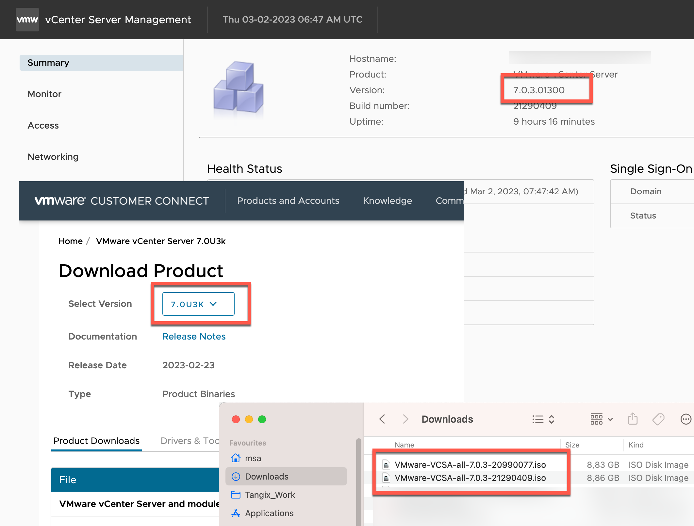
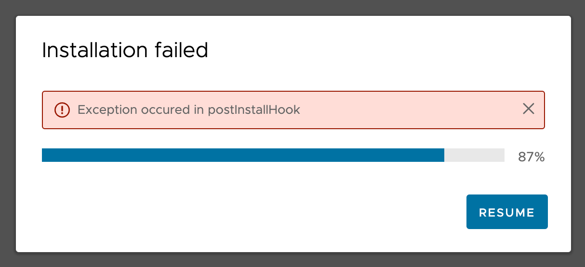
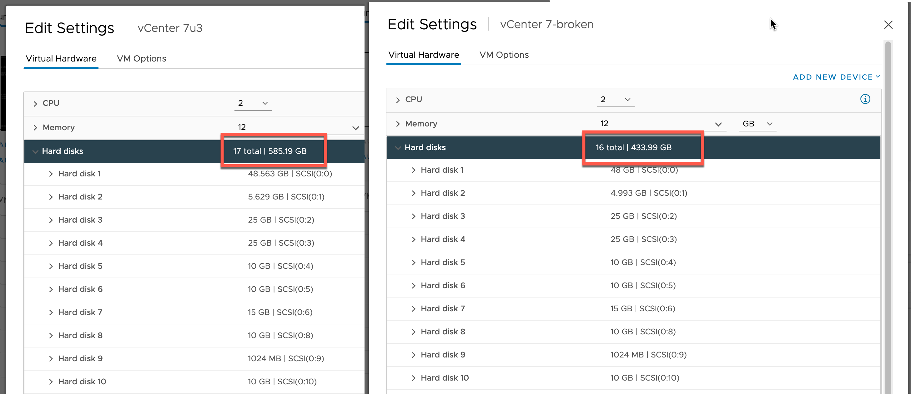

# Reinstallation of VMware vCenter

After reading about the recent ESXi vulnerability I decided to check over our ESXi and vCenter (the central admin tool) servers. None of the ESXi servers were found to be vulnerable (they were both installed after 2021 and the affected services is either not installed or enabled) but I decided to upgrade vCenter any way - **BAD MOVE!**

Upgrading vCenter is always a scary thing. vCenter runs as a Virtual Machine (VM) appliance magically installed through a macOS or Windows application. Upgrades have always been scary, easily in par with Atlassian products. It's also a huge VM, allocating 12 GB of RAM but also 17(!) hard disks defined! Backups have been running weekly and I have checked that they are uploaded correctly.

So with backups running, upgrading from 7.0.3.01200 to 7.0.3.01300 shouldn't pose any risk, right? Not so true!

## VMware's Version Hell

VMware is the only company that I know of that is actively working on confusing their customers with 3 - **three** - different versioning systems! 



Looking in vCenter application, the version number is shown as *7.0.3.01300*. However, on VMware's support pages, the same version are referred to *7.0U3k*. And to make it even harder, the ISO-files introduce the build number so the same version is now named *VMware-VCSA-all-7.0.3-21290409.iso*.

```
7.0.3.01300 == 7.0U3k == 7.0.3-21290409
```

Finally understand which version I am on and which version to upgrade to I started vCenter's built-in upgrade wizard and went ahead.

## The simple Upgrade the Failed (miserably!)

In the upgrade wizard there is a mandatory step to confirm that a backup has been made. Checking that I see that the latest backup completed successfully. Fine, right? I started the upgrade.

The upgrade hummed along for about 25 minutes and then displayed the message of doom:



Clicking resume showed a message asking me to collect logs from the wrecked vCenter installation. Unfortunately the link to collect logs showed a blank webpage with the message `No healthy upstream`.

Rebooting, the vCenter appliance displayed a kernel panic in the console. Sigh!

## Plan B - Backups are good, right?

Giving up on this failed installation I went with Plan B, confident that the backups are OK. Following the two-step process to restore from backup I went ahead.

First hurdle is the installer of vCenter that fails to run properly on macOS Catalina. A [KB article](https://kb.vmware.com/auth?state=%2Fs%2Farticle%2F79416) exists that recommends using a Windows machine or disable the developer validation in Catalina with the command `sudo spctl --global-disable` - sigh! First step successfully deployed the VM on the ESXi instance.

Second step asked for the URL to the SFTP backup and credentials. Fine, entered that and the installer hummed away doing its magic. After a while the restore failed with the messages:

```
Metadata and system validation failed
Error: Unknown system resource type vtsdb
Error: Unknown system resource type seat
```

## No - backups are not good until tested!

Long story short - found this [excellent article](https://medium.com/@mikecarpendale/vcenter-server-appliance-restore-fails-if-youve-tinkered-with-the-vm-resources-7eb8797b0544) describing why the restore failed and saw directly that this was my problem. My old vCenter VM contained "only" 16 disks but the newly installed a whooping 17 disks! 



The backup from a "16 disk vCenter" installation (made in early 2020) was for some stupid reason not possible to restore on a current "17 disk vCenter" installation - *even when using exactly the same vCenter version!* 

## Plan C - just reinstall!

With knowledge of what to search for I found many vCenter users in the same situation - problems restoring backups to new installations. The easiest solution seems to be to simply reinstall and re-add the ESXi servers. I lost historical performance data but I can live with that.

Another fun evening!